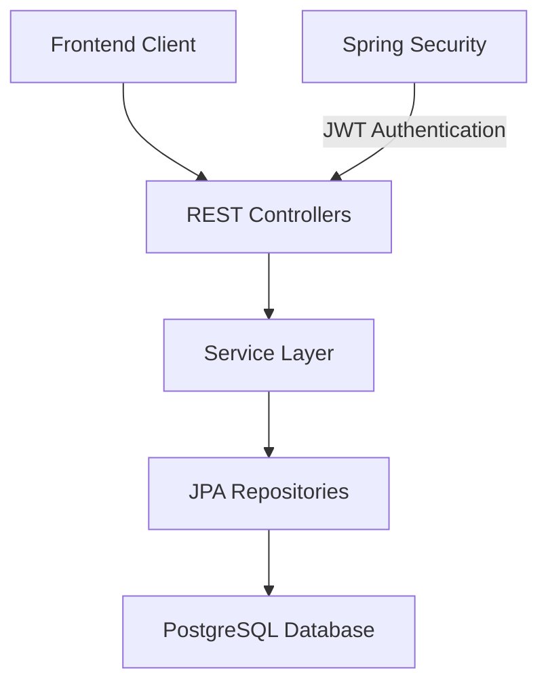
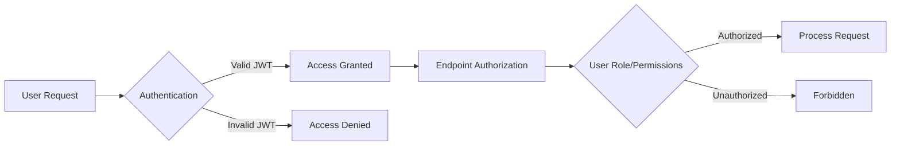

# 🌟 Tour Guide Blog Application

## 📝 Overview

Atlas is not just a blogging platform—it’s a geographical narrative engine that allows travelers, locals, and explorers to anchor their stories to specific territories. Our application bridges personal experiences with geographical context, transforming how we share and discover local narratives

## 🛠 Tech Stack

| Category | Technologies |
|----------|--------------|
| Language |  |
| Framework |  |
| Security |  |
| Database |  |
| Build Tool |  |

## 🚀 Architecture Diagram

## ✨ Key Features

| Feature | Description | Access Level |
|---------|-------------|--------------|
| 🔐 User Authentication | Secure signup and login | Public/Authenticated |
| 📊 Post Management | Create, update, delete posts | Authenticated |
| 🏷️ Tagging System | Organize content with tags | Public |
| 📂 Category Management | Group and filter content | Public |
| 📝 Draft Posts | Manage unpublished content | Authenticated |

## 🌈 Endpoint Classification

### 🔓 Public Endpoints
| Endpoint | Method | Description |
|----------|--------|-------------|
| `/api/v1/posts` | GET | List all posts |
| `/api/v1/categories` | GET | List categories |
| `/api/v1/tags` | GET | List tags |

### 🔒 Authenticated Endpoints
| Endpoint | Method | Description |
|----------|--------|-------------|
| `/api/v1/posts/drafts` | GET | Access draft posts |
| `/api/v1/posts` | POST | Create new post |
| `/api/v1/categories` | POST | Create category |

## 🛡️ Security Highlights

## 🚀 Quick Start

### Prerequisites
- ☕ Java 17
- 🐘 PostgreSQL
- 📦 Maven

### Installation Steps
1. Clone the repository
2. Make sure you have `Docker` installed
3. Run this command in the command line `docker-compose up --build -d`
4. Run `./mvnw spring-boot:run`

## 📡 Deployment Options

| Option | Description | Complexity |
|--------|-------------|------------|
| 🐳 Docker Compose | Containerized deployment | Medium |
| 🖥️ Local Maven | Direct Spring Boot run | Low |
| ☁️ Cloud Platforms | AWS, Azure, GCP | High |

## 🤝 Contributing

1. 🍴 Fork the repository
2. 🌿 Create feature branch
3. 💾 Commit changes
4. 📤 Push to branch
5. 🔀 Create Pull Request
